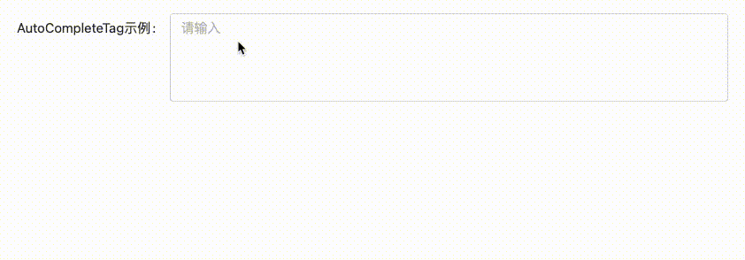

# AutoCompleteTag 帮助文档

## 演示效果


## 参数配置
| 参数 | 类型 | 说明 | 默认值 |
| --- | --- | --- | --- |
| inputType | 'text' &#124; 'input' | 输入类型, 支持文本域及输入框 | `text` |
| inputClass | Object | 输入框样式, 可自定义 | `{}` |
| placeholder | String | 输入框提示语 | `请输入` |
| allowClear | Boolean | 是否允许清空, 为 true 时, 显示可清空按钮 | `true` |
| disabled | Boolean | 是否禁用组件 | `false` |
| rows | Number | 文本域所占行数, inputType 为 text 生效 | `4` |
| resize | Boolean | 文本域是否允许调整大小, inputType 为 text 生效 | `true` |
| trigger | 'hover' &#124; 'focus' &#124; 'click' | 提示框触发发式, 建议使用默认的 `click` | `click` |
| width | String | 提示面板宽度, 支持 `px` 或 `%` | `600px` |
| data | Array | 数据源, 提示内容 | `[]` |
| dataTitle | String | 数据源标题 | `快速输入` |
| showTime | Boolean | 是否显示常用时间, 默认提示标签 | `true` |
| separator | String | 文本分割符 | `，` |
| apiConfig | Object | _配置接口信息, 详细见下方 apiConfig 参数_ | `{}` |

## ApiConfig 接口参数配置
| 参数 | 类型 | 说明 | 默认值 |
| --- | --- | --- | --- |
| method | 'get' &#124; 'post' | 接口请求方式, 支持 `get` &#124; `post` | `get` |
| url | String | 请求的接口地址, 若设置则开启搜索框, 支持远程搜索 |  |
| params | Object | 额外请求参数, 用于一般数据过滤或排序 |  |
| textField | String | 接口返回字段, 用于显示文本 |  |
| searchField | String | 搜索字段 |  |

## Demo
### 前台静态数据
```shell
<template>
  <auto-complete-tag v-model="autoCompleteTag" :data="dataSource"/>
</template>
<script>
 export default {
   name: 'AutoCompleteTagDemo',
   components: {
     AutoCompleteTag
   },
   data() {
     return {
       dataSource: ['一', '二', '三', '四', '五', '六', '七']
     }
   }
 }
</script>
```
```shell
<template>
  <auto-complete-tag v-model="autoCompleteTag" :api-config="autoCompleteTagApiConfig"/>
</template>
<script>
 export default {
   name: 'AutoCompleteTagDemo',
   components: {
     AutoCompleteTag
   },
   data() {
     return {
       autoCompleteTagApiConfig: {
          url: '/medicalfield/medicalFieldTemplate/common/list',
          textField: 'templateContent',
          searchField: 'templateContent',
          params: {
            column: 'numberOfTimes',
            limit: 20
          }
        }
     }
   }
 }
</script>
```
